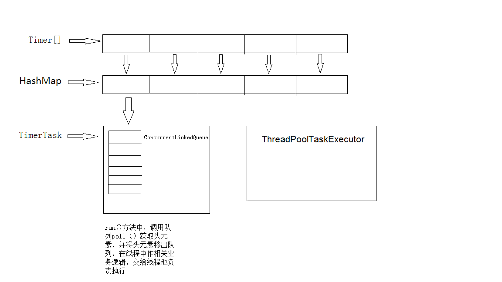

#标题h1
##标题h2
###标题h3 

**序表 .后保持空格**

1. 序列1   
    1.1. 序列1.1  
    1.2. 序列1.2
2. 序列2
3. 序列3

**小标题 [*/+/-]后保持空格**
* 小标题
>1、代码1  
>>1.1、代码2  
>>>1.1.1、代码3

+ 小标题  
<http://www.baidu.com>


- 小标题

[TOC]

一级标题
=
二级标题
---------------------

```
 HAHA 
     HAHA 
        HASDA
     
```

我是  
    第三方  
      阿三巨大 
  
    haha
        啥都
            ajajaj
              
  
我是文字……

    <div>   
        <div></div>
        <div></div>
        <div></div>
    </div>
    



这是文字……  

- [ ] 选项1  
- [ ] 选项2

这是文字……

- [x] 选项一
- [ ] 选项二  
- [ ]  [选项3]

***
---
* * *